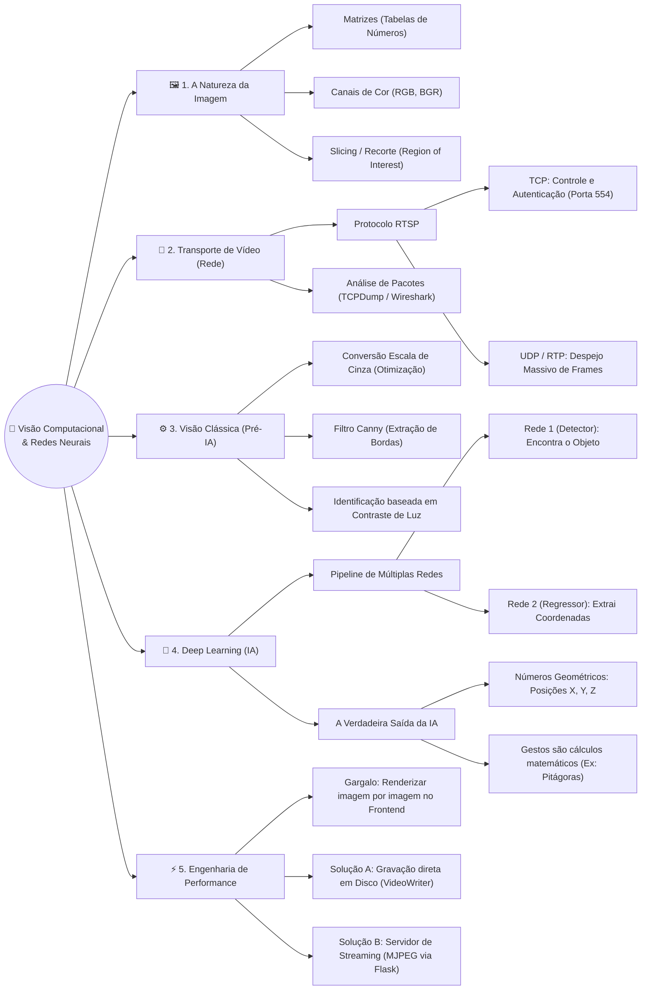

# 🧠 Mapa Mental: Laboratório de Visão Computacional e IA

Este diagrama resume toda a nossa jornada técnica desconstruindo como o computador enxerga o mundo, desde a captura dos pacotes de rede até o processamento geométrico feito por Redes Neurais Profundas (Deep Learning).

---

### Resumo dos Principais Pontos sobre Redes Neurais (MediaPipe)
Se alguém te perguntar *"Como o MediaPipe da Google funciona no código que você fez?"*, aqui está a resposta definitiva:

> [!NOTE] 
> **A IA não "pinta" a tela, ela faz cálculos geométricos.**
> A rede neural é um modelo treinado em milhões de fotos. Quando você manda um frame para ela, ela não te devolve uma imagem com linhas verdes desenhadas. Ela retorna um documento cheio de **Coordenadas Matemáticas**. Todo o trabalho de desenhar as linhas (Computação Gráfica) ou calcular distâncias para saber se você fez um gesto de pinça é feito por algoritmos paralelos usando os dados puros que a IA encontrou.

> [!TIP]
> **O truque do Pipeline.**
> Redes neurais pesadas travam PCs comuns. A Google resolveu isso quebrando a rede ao meio. A primeira rede procura apenas onde o alvo está (sua mão). Assim, a segunda rede neural (muito mais inteligente e pesada) só precisa olhar para uma fração minúscula da imagem, calculando o esqueleto (Landmarks) quase instantaneamente.
